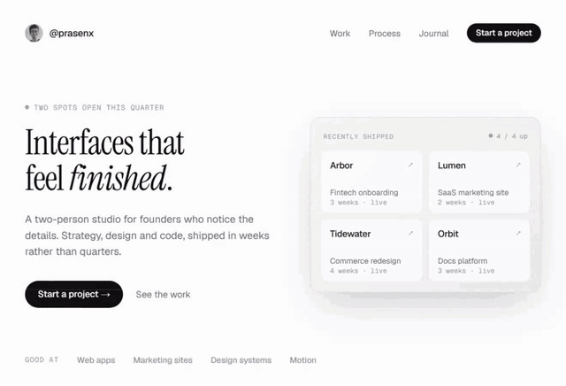

# Tile Reveal

A hero section that's secretly a grid of tiles. Move your cursor and the tiles under it flip over in a wave to reveal what's underneath, then settle back. Click empty space to flip the whole thing and hold it.

The demo puts a finished landing page on the front and its **blueprint** on the back: the same layout drawn as dashed outlines on grid paper, with type specs and dimensions in monospace. Hover to see how it's built.

## Preview



**Live demo:** [starknightt.github.io/tile-reveal](https://starknightt.github.io/tile-reveal/) · [Watch in HD (mp4)](media/demo.mp4)

## Tech Stack

- **React 19** — client component, one pointer handler, no state on the hot path
- **Tailwind CSS v4** — styling
- **Next.js 16** — app shell for the demo only; the component has no Next dependency
- **TypeScript** — fully typed props

No canvas, no WebGL, no animation library. The flip is CSS 3D transforms and transitions.

## Installation

Copy [`tile-reveal.tsx`](src/components/tile-reveal.tsx) into your project:

```
src/components/tile-reveal.tsx
```

Then add the flip rule to your global CSS (from [`globals.css`](src/app/globals.css)):

```css
.tr-tile { transform: rotateY(0deg); }
.tr-tile[data-flipped="true"] { transform: rotateY(calc(180deg * var(--tr-dir, 1))); }

@media (prefers-reduced-motion: reduce) {
  .tr-tile { transition-duration: 0ms !important; transition-delay: 0ms !important; }
}
```

Requires React 18+ and Tailwind (the component uses a handful of utility classes plus inline styles for the dynamic bits).

## Usage

```tsx
import { TileReveal } from "@/components/tile-reveal";

export default function Hero() {
  return (
    <TileReveal
      front={<Landing variant="design" />}
      back={<Landing variant="blueprint" />}
      overlay={<Landing variant="design" />}
      rows={8}
      cols={12}
      radius={150}
      className="h-[600px] w-[880px] rounded-2xl bg-white"
    />
  );
}
```

`front` and `back` should be full-size layouts (`h-full w-full`). When both sides share the same structure, the swap reads as the page itself turning over rather than an overlay appearing.

## Props

| Prop | Type | Default | Description |
|------|------|---------|-------------|
| `front` | `ReactNode` | — | Content shown at rest. |
| `back` | `ReactNode` | — | Content revealed when a tile flips. |
| `overlay` | `ReactNode` | `undefined` | Invisible interactive copy rendered on top. Only its `<a>` / `<button>` elements are hit-testable, so links work while the tiled copies stay inert. Also the only copy exposed to assistive tech. |
| `rows` | `number` | `8` | Grid rows. |
| `cols` | `number` | `12` | Grid columns. |
| `radius` | `number` | `150` | Cursor influence radius in px. |
| `hold` | `number` | `700` | How long a tile stays flipped after the cursor moves on (ms). |
| `duration` | `number` | `620` | Single flip duration (ms). |
| `stagger` | `number` | `140` | Max transition delay across the radius (ms). This is the wave. |
| `clickToLock` | `boolean` | `true` | Click empty space to cascade the whole grid to the back and hold it; click again to release. |
| `className` | `string` | `""` | Applied to the container. Give it a size. |
| `style` | `CSSProperties` | `undefined` | Applied to the container. |

## Examples

### Light ↔ dark

The simplest use: same layout, inverted palette.

```tsx
<TileReveal
  front={<Hero theme="light" />}
  back={<Hero theme="dark" />}
  className="h-[70vh] w-full"
/>
```

### Marketing ↔ product

Put the pitch on the front and the actual product screenshot on the back.

```tsx
<TileReveal
  front={<Pitch />}
  back={}
  rows={6}
  cols={10}
  radius={200}
  hold={1200}
/>
```

### Calmer wave

Fewer, larger tiles and a longer stagger.

```tsx
<TileReveal front={...} back={...} rows={5} cols={8} duration={800} stagger={260} />
```

## How It Works

1. Every tile is a **full-size copy of the content**, clipped to its cell with `clip-path: inset(...)`. Because nothing is resized, content stays pixel-aligned across tile edges and the grid is invisible at rest.
2. Inside each clipped cell sits a `transform-style: preserve-3d` element holding two faces: the front, and the back pre-rotated 180°. Both are `backface-visibility: hidden`, so rotating the parent 180° swaps them. Clipping and rotation live on **separate elements**: `clip-path` on the rotating element would force it flat and break backface culling.
3. One `pointermove` handler measures the distance from the cursor to every cell center. Tiles inside `radius` flip with a `transition-delay` proportional to that distance, which produces the wave. Flip direction follows cursor travel through a `--tr-dir` CSS variable.
4. No React re-renders on the hot path. The handler writes `data-flipped` and `--tr-dir` straight to DOM nodes and CSS transitions animate `transform` on the compositor. A single `requestAnimationFrame` loop unflips tiles when their hold expires and only runs while something is flipped.
5. The tiled copies are `inert` and `aria-hidden`; `overlay` (or the first tile, if no overlay) is what screen readers and keyboards see.

## Performance notes

- 8×12 = 96 tiles is comfortable on a laptop. Each tile is two extra copies of your hero, so keep `front` / `back` reasonably light (text, a few boxes, one image).
- Everything animated is `transform` only. No layout or paint on the hot path.
- Geometry is precomputed as percentages, so resizing costs nothing.

## Browser Support

Any browser with CSS 3D transforms and `clip-path`:

- Chrome / Edge 90+
- Firefox 90+
- Safari 15+
- Mobile Safari / Chrome on iOS and Android (touch drag flips tiles; `touch-action: pan-y` keeps vertical scroll working)

## Run locally

```bash
pnpm install
pnpm dev
```

## License

MIT
